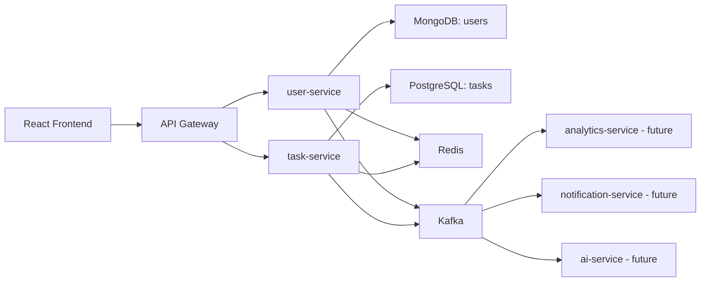

# TaskPro Microservices Upgrade Plan

## Document Control

| Field | Value |
| --- | --- |
| Product | TaskPro |
| Document | Product and architecture implementation plan |
| Audience | Developer, product owner, project manager, interviewer, future contributors |
| Prepared for | TaskPro backend microservices upgrade |
| Current repo state | React Vite frontend plus monolithic Spring Boot backend |
| Target state | Production-inspired microservice architecture with clear service ownership, API Gateway, MongoDB for users, PostgreSQL for tasks, JWT auth, Redis sessions, Kafka events, Docker, Kubernetes, observability, no-cost AI-style features, Weather API, Calendar integration, and analytics features |
| Last updated | 2026-06-05 |
| Status | Planning baseline for discussion and phased implementation |

## 1. Executive Summary

TaskPro started as a simple task management application with a Spring Boot backend and a React Vite frontend. The backend currently works as a monolith: user management, authentication, task CRUD, JWT handling, repositories, and configuration all live inside one Spring Boot application.

The next product and engineering objective is to evolve TaskPro into a beginner-friendly but production-inspired microservice system. The focus is not to add technologies only for resume value. Each new component must be connected to a visible product capability and a clear engineering reason.

The target backend will be split into:

- `common-dto`: shared DTOs, event payloads, and API contract objects.
- `user-service`: authentication, user profile, roles, JWT issuing, refresh sessions, and account lifecycle.
- `task-service`: task CRUD, search/filtering, user-owned PostgreSQL task data, due dates, task activity events, and task analytics inputs.
- `api-gateway`: single backend entry point for the frontend, routing, CORS, and eventually security/rate-limiting concerns.

Additional production-grade capabilities will be introduced gradually:

- Redis for refresh-token sessions, logout, rate limiting, API caching, and idempotency.
- Kafka for visible event-driven flows such as task activity, analytics, notifications, and AI processing.
- Docker Compose for local multi-service development.
- Kubernetes through Rancher Desktop or another local Kubernetes runtime.
- CI/CD through GitHub Actions first, Jenkins later if required.
- Observability through Actuator, structured logs, request IDs, health checks, metrics, and tracing-ready design.
- No-cost AI-style features such as rule-based/mock task breakdown, priority suggestion, sentiment analysis, weekly productivity summary, and an assistant chatbot in later phases.
- Weather API and Calendar integration for planning context, calendar export, and future calendar sync.

This `plan.md` acts as the single working roadmap and implementation reference. Future planning updates should stay in this file unless the owner explicitly asks to split documentation.

## 2. Current State Assessment

### 2.1 Current Frontend

The frontend is a React Vite application using Material UI. It currently contains:

- Login page.
- Signup page.
- Dashboard page.
- Task grid/cards/stats components.
- A centralized `apiClient`.

Current frontend API behavior:

- The frontend talks to a single backend base URL.
- Login and signup are public endpoints.
- Task endpoints require a Bearer token.
- JWT is stored in `localStorage`.

This is a good starting point. In the target architecture, the frontend should continue calling one public backend base URL, ideally the `api-gateway`, instead of calling every microservice directly.

### 2.2 Current Backend

The backend is a single Spring Boot application with:

- User endpoints under `/user`.
- Task endpoints under `/api/tasks`.
- Public health endpoint under `/public/health-check`.
- MongoDB persistence.
- Spring Security.
- JWT generation and validation.
- Redis dependency/config presence.
- Weather API configuration presence.

Current backend package examples:

- `controller`
- `service`
- `repository`
- `entity`
- `dto`
- `security`
- `config`

### 2.3 Current Important Gaps

| Area | Current gap | Why it matters |
| --- | --- | --- |
| Service boundaries | User and task logic are inside one backend | Prevents true microservice ownership |
| Task ownership | Task service currently does not properly filter all task access by authenticated user | Security and data isolation issue |
| Secrets | Real-looking secrets and API keys exist in committed config files | Must be rotated and moved to env vars |
| Auth lifecycle | JWT exists, but refresh sessions/logout/session management are not production-grade yet | Real systems need token lifecycle controls |
| DTO design | Entities are exposed directly in request/response flows | Creates tight coupling and weak API contracts |
| Error handling | No standard global API error response model yet | Frontend and debugging become inconsistent |
| Validation | Request validation is minimal | Bad input can reach service/repository layers |
| Observability | Limited health, metrics, and tracing support | Hard to debug multi-service systems |
| Deployment | No complete Docker Compose/Kubernetes setup yet | Hard to run as a true distributed system |
| Async processing | No visible Kafka workflow yet | Event-driven architecture not demonstrated |

### 2.4 Immediate Risk Notice

The repository contains committed configuration values that look like real credentials or API keys. Before deploying, sharing, or continuing serious development:

1. Rotate those secrets in the external systems.
2. Remove secret values from tracked config files.
3. Use environment variables or secret managers.
4. Add `.env.example` with placeholder values only.
5. Ensure `.env` is gitignored.

No future documentation should repeat the secret values.

## 3. Product Vision

TaskPro should become a personal productivity platform where users can:

- Securely create accounts and manage sessions.
- Create, update, complete, delete, and search tasks.
- Organize tasks by status, priority, due date, and tags.
- Receive smart task suggestions.
- See productivity analytics.
- Get reminders for upcoming or overdue tasks.
- Use AI to break big goals into smaller tasks.
- Receive summaries and insights about their work habits.

The product should demonstrate real-world backend engineering while remaining explainable for a beginner.

## 4. Product Goals

### 4.1 Primary Goals

- Split the monolithic backend into microservices.
- Keep service responsibilities clear and beginner-friendly.
- Ensure the frontend has a smooth single-entry API experience.
- Improve authentication with JWT, refresh tokens, logout, and user sessions.
- Use Kafka for visible event-driven product features.
- Use Redis for practical product and platform concerns.
- Containerize the complete system.
- Add enough observability and tests to explain production readiness.

### 4.2 Secondary Goals

- Add AI-powered features that are useful in a task manager.
- Add analytics features that are visible in the UI.
- Add external API integrations that make product sense.
- Prepare Kubernetes deployment manifests.
- Add CI/CD workflows.

### 4.3 Non-Goals For Initial Phases

- Do not build too many services immediately.
- Do not add Kubernetes before Docker Compose is stable.
- Do not add Jenkins before basic CI is working.
- Do not implement OAuth2 social login before JWT/session basics are complete.
- Do not make the frontend call every service directly.
- Do not share databases across services.

## 5. Target Architecture Overview

### 5.1 High-Level Architecture



### 5.2 Backend Modules

| Module | Type | Responsibility |
| --- | --- | --- |
| `common-dto` | Maven library | Shared DTOs, event contracts, error models, enums |
| `user-service` | Spring Boot app | Users, signup, login, JWT issuing, refresh sessions, roles, profile |
| `task-service` | Spring Boot app | Task CRUD, ownership, search, status/priority updates, task events, PostgreSQL persistence |
| `api-gateway` | Spring Boot app | Single frontend entry point, routing, CORS, gateway-level filters |
| `analytics-service` | Future Spring Boot app | Productivity stats, trends, sentiment, completion analytics |
| `notification-service` | Future Spring Boot app | Due reminders, email, notification history |
| `ai-service` | Future Spring Boot app | AI summaries, task breakdowns, priority suggestions, chatbot |

### 5.3 Recommended Initial Services

Initial implementation should include:

1. `common-dto`
2. `user-service`
3. `task-service`
4. `api-gateway`

Future services should be added only after the core split is stable:

1. `analytics-service`
2. `notification-service`
3. `ai-service`

## 6. Key Architecture Decisions

### 6.1 Keep A Single Frontend Entry Point

Decision:

The frontend should call the API Gateway, not individual services.

Reason:

- Keeps CORS simple.
- Keeps frontend configuration simple.
- Makes auth routing easier.
- Looks more like real production systems.
- Allows internal service URLs to change without frontend changes.

Frontend target:

```text
VITE_API_BASE_URL=http://localhost:8080
```

Gateway public routes:

```text
/api/auth/**  -> user-service
/api/users/** -> user-service
/api/tasks/** -> task-service
```

### 6.2 Use JWT Plus Redis Sessions

Decision:

Use JWT access tokens with Redis-backed refresh sessions.

Reason:

- JWT access tokens allow services to validate requests locally.
- Redis sessions allow logout, refresh-token rotation, and active-session tracking.
- This is simpler than full OAuth2/OIDC and is better as the first production-style auth step.

Important clarification:

- JWT is a token format.
- OAuth2/OIDC is a login and authorization protocol.
- The recommended first milestone is custom username/password login with JWT access token and Redis refresh sessions.
- OAuth2 social login can be added later as an optional feature.

### 6.3 Services Own Their Own Data

Decision:

Each microservice owns its own data collection/database.

Reason:

- Prevents tight coupling.
- Makes service boundaries real.
- Avoids hidden monolith behavior.
- Supports future independent scaling.

Rule:

`task-service` must not directly read or write the user database. It should trust JWT claims or call a user-service API only when absolutely needed.

### 6.4 Use Kafka For Product-Visible Events

Decision:

Kafka should be used only for flows that can be demonstrated.

Good first Kafka events:

- `user.created`
- `task.created`
- `task.updated`
- `task.completed`
- `task.deleted`

Good visible features:

- Activity feed.
- Productivity analytics.
- Notification reminders.
- AI background analysis.

### 6.5 Use Redis For More Than Cache

Decision:

Redis should support production-style behavior:

- Refresh-token sessions.
- Logout token revocation.
- Login rate limiting.
- External API response cache.
- AI result cache.
- Kafka idempotency keys.

Best first Redis feature:

User sessions and refresh-token management.

### 6.6 Docker Before Kubernetes

Decision:

Implement Docker Compose before Kubernetes.

Reason:

- Docker Compose gives fast local feedback.
- Kubernetes is easier once service ports, health checks, and env vars are clean.
- Interview explanation becomes more natural: local dev first, orchestration second.

### 6.7 GitHub Actions Before Jenkins

Decision:

Start with GitHub Actions and optionally add Jenkins later.

Reason:

- GitHub Actions is faster to set up.
- It is enough to demonstrate CI quality gates.
- Jenkins can be added later if the goal is to show classic enterprise CI/CD.

### 6.8 Use MongoDB For Users And PostgreSQL For Tasks

Decision:

User-service will use MongoDB. Task-service will use PostgreSQL.

Reason:

- The existing user data model already fits MongoDB and can be migrated with less disruption.
- PostgreSQL is a strong production-style choice for task data because tasks benefit from relational querying, indexes, sorting, filtering, due-date queries, and future reporting.
- Using two database technologies also makes the microservice boundary more visible: each service owns its own database and persistence model.

Implementation notes:

- User-service should use Spring Data MongoDB.
- Task-service should use Spring Data JPA with PostgreSQL.
- `common-dto` must not contain MongoDB or JPA entity annotations.
- Task IDs should use either UUIDs or database-generated IDs; UUIDs are preferred for easier cross-service event references.

### 6.9 Keep AI No-Cost For Now

Decision:

AI features will start as no-cost mock/rule-based features.

Reason:

- The project can demonstrate AI-style product behavior without paid API usage.
- The frontend and backend contracts can be built now.
- A real AI provider can be plugged in later behind the same service interface.

Initial no-cost AI behavior:

- Rule-based task breakdown templates.
- Rule-based priority suggestion.
- Mock weekly summary generation.
- Optional chatbot intent matching using backend rules.

### 6.10 Keep Weather API And Add Calendar Integration

Decision:

The Weather API will stay, and Calendar functionality will be added.

Reason:

- Weather can support a daily planning context in the dashboard.
- Calendar integration directly fits task due dates and reminders.
- Calendar can start with a no-cost `.ics` export before adding Google Calendar or Microsoft Calendar sync.

Initial calendar behavior:

- Generate an `.ics` calendar event for a task due date.
- Let the frontend offer "Add to calendar".
- Add real Google/Microsoft Calendar sync later when OAuth flow is planned.

### 6.11 Keep Planning Documentation In `plan.md`

Decision:

Do not split the roadmap into `ARCHITECTURE.md`, `IMPLEMENTATION_PLAN.md`, or `RUNBOOK.md` for now.

Reason:

- One file keeps the learning path simple.
- Context stays easier to preserve.
- We can still structure `plan.md` professionally with product, architecture, roadmap, and Jira sections.

## 7. Target Repository Structure

Recommended future structure:

```text
task-pro/
  README.md
  plan.md
  docker-compose.yml
  .env.example

  frontend/
    src/
    package.json

  backend/
    pom.xml

    common-dto/
      pom.xml
      src/main/java/com/ciscotraining/taskpro/common/

    user-service/
      pom.xml
      src/main/java/com/ciscotraining/taskpro/user/
      src/main/resources/application.yml

    task-service/
      pom.xml
      src/main/java/com/ciscotraining/taskpro/task/
      src/main/resources/application.yml

    api-gateway/
      pom.xml
      src/main/java/com/ciscotraining/taskpro/gateway/
      src/main/resources/application.yml

    analytics-service/
      pom.xml
      src/main/java/com/ciscotraining/taskpro/analytics/

    notification-service/
      pom.xml
      src/main/java/com/ciscotraining/taskpro/notification/

    ai-service/
      pom.xml
      src/main/java/com/ciscotraining/taskpro/ai/

  k8s/
    local/
      mongodb.yaml
      postgresql.yaml
      redis.yaml
      kafka.yaml
      user-service.yaml
      task-service.yaml
      api-gateway.yaml
      frontend.yaml
```

## 8. Core Domain Model

### 8.1 User Domain

User-service owns user identity and profile.

Recommended user fields:

| Field | Type | Notes |
| --- | --- | --- |
| `id` | String/ObjectId | Stable internal user id |
| `username` | String | Unique |
| `email` | String | Unique if email login is enabled |
| `passwordHash` | String | Never expose |
| `roles` | List<String> | Example: `USER`, `ADMIN` |
| `createdAt` | Instant | Audit |
| `updatedAt` | Instant | Audit |
| `status` | String | `ACTIVE`, `LOCKED`, `DELETED` |

Important:

- Do not expose password hashes.
- Do not use entity classes directly as API responses.
- Use `UserResponse`.

### 8.2 Task Domain

Task-service owns task data.

Recommended task fields:

| Field | Type | Notes |
| --- | --- | --- |
| `id` | UUID/String | Task id stored in PostgreSQL |
| `ownerUserId` | String | Required for every task |
| `title` | String | Required |
| `description` | String | Optional |
| `status` | Enum | `PENDING`, `IN_PROGRESS`, `COMPLETED`, `CANCELLED` |
| `priority` | Enum | `LOW`, `MEDIUM`, `HIGH`, `URGENT` |
| `dueDate` | Instant/LocalDateTime | Optional |
| `tags` | List<String> | Future |
| `createdAt` | Instant | Audit |
| `updatedAt` | Instant | Audit |
| `completedAt` | Instant | Set when completed |

Important:

- Every task query must filter by `ownerUserId`.
- Task-service should take `ownerUserId` from JWT claims, not request body.
- Users must never be able to fetch/update/delete another user's task.

## 9. API Design Draft

### 9.1 Auth APIs

Public endpoints:

```text
POST /api/auth/signup
POST /api/auth/login
POST /api/auth/refresh
```

Protected endpoints:

```text
POST /api/auth/logout
GET  /api/auth/sessions
DELETE /api/auth/sessions/{sessionId}
```

Signup request:

```json
{
  "username": "anbag",
  "email": "user@example.com",
  "password": "strongPassword"
}
```

Login response:

```json
{
  "accessToken": "jwt-access-token",
  "refreshToken": "refresh-token-or-cookie-backed-session",
  "expiresIn": 900,
  "user": {
    "id": "user-id",
    "username": "anbag",
    "roles": ["USER"]
  }
}
```

### 9.2 User APIs

```text
GET    /api/users/me
PUT    /api/users/me
DELETE /api/users/me
```

Admin future endpoints:

```text
GET    /api/admin/users
GET    /api/admin/users/{id}
PATCH  /api/admin/users/{id}/status
```

### 9.3 Task APIs

```text
GET    /api/tasks
POST   /api/tasks
GET    /api/tasks/{id}
PUT    /api/tasks/{id}
PATCH  /api/tasks/{id}/status
DELETE /api/tasks/{id}
GET    /api/tasks/search
GET    /api/tasks/today
GET    /api/tasks/upcoming
GET    /api/tasks/overdue
```

Create task request:

```json
{
  "title": "Prepare microservices explanation",
  "description": "Write down service boundaries and JWT flow",
  "status": "PENDING",
  "priority": "HIGH",
  "dueDate": "2026-06-10T18:00:00"
}
```

Task response:

```json
{
  "id": "task-id",
  "title": "Prepare microservices explanation",
  "description": "Write down service boundaries and JWT flow",
  "status": "PENDING",
  "priority": "HIGH",
  "dueDate": "2026-06-10T18:00:00",
  "createdAt": "2026-06-05T10:00:00",
  "updatedAt": "2026-06-05T10:00:00"
}
```

### 9.4 Analytics APIs - Future

```text
GET /api/analytics/summary
GET /api/analytics/productivity/weekly
GET /api/analytics/tasks/by-status
GET /api/analytics/tasks/by-priority
GET /api/analytics/streaks
```

### 9.5 AI APIs - Future

```text
POST /api/ai/tasks/breakdown
POST /api/ai/tasks/suggest-priority
POST /api/ai/tasks/summarize-week
POST /api/ai/chat
```

## 10. Event Catalog

### 10.1 Event Naming Rules

Use dot-separated names:

```text
domain.action
```

Examples:

```text
user.created
task.created
task.completed
task.deleted
```

### 10.2 Common Event Envelope

Recommended event envelope:

```json
{
  "eventId": "uuid",
  "eventType": "task.created",
  "version": 1,
  "occurredAt": "2026-06-05T10:00:00Z",
  "producer": "task-service",
  "correlationId": "request-correlation-id",
  "userId": "user-id",
  "payload": {}
}
```

### 10.3 Initial Events

| Event | Producer | Consumers | Purpose |
| --- | --- | --- | --- |
| `user.created` | user-service | analytics-service, notification-service | Welcome flow, user metrics |
| `user.deleted` | user-service | task-service, analytics-service | Account cleanup strategy |
| `task.created` | task-service | analytics-service, notification-service, ai-service | Activity tracking, reminders, AI suggestions |
| `task.updated` | task-service | analytics-service | Productivity history |
| `task.completed` | task-service | analytics-service, notification-service | Completion analytics, celebration notification |
| `task.deleted` | task-service | analytics-service | Audit/activity history |
| `task.due_soon` | scheduler/notification-service | notification-service | Reminder delivery |
| `task.overdue` | scheduler/notification-service | notification-service, analytics-service | Overdue tracking |

## 11. Feature Documentation

### 11.1 Feature: Secure Authentication

Goal:

Allow users to safely sign up, log in, refresh sessions, and log out.

User value:

Users can trust that their data belongs only to them and that they can end sessions when needed.

Backend behavior:

1. User signs up with username, email, and password.
2. Password is hashed using BCrypt.
3. User-service creates user record.
4. User-service issues access token and refresh session.
5. Refresh session is stored in Redis.
6. Login returns user summary plus token data.

Production details:

- Access token should be short-lived.
- Refresh token should be longer-lived and stored server-side in Redis.
- Logout should delete the refresh session.
- Refresh-token rotation should be added after basic refresh works.

Acceptance indicators:

- Invalid login returns `401`.
- Duplicate username returns `409`.
- Invalid request returns `400`.
- Password hash is never returned.
- Logout prevents refresh token reuse.

### 11.2 Feature: User Sessions

Goal:

Let users see and revoke active sessions.

User value:

Users can log out from old devices.

Backend behavior:

1. On login, create a Redis session.
2. Store session id, user id, username, issued time, expiry time, device metadata if available.
3. On refresh, verify Redis session exists.
4. On logout, delete current session.
5. On session revoke, delete selected session.

Possible Redis key shape:

```text
session:{sessionId}
user-sessions:{userId}
revoked-token:{jti}
```

### 11.3 Feature: User-Owned Tasks

Goal:

Ensure every task belongs to exactly one user.

User value:

Users only see and modify their own tasks.

Backend behavior:

1. Task-service extracts `userId` from JWT.
2. Task-service sets `ownerUserId` during task creation.
3. Task-service filters every query by `ownerUserId`.
4. Task-service validates ownership before update/delete.

Acceptance indicators:

- User A cannot read User B's task.
- User A cannot update User B's task.
- Search results include only User A's tasks.
- Deleting account has a defined task cleanup strategy.

### 11.4 Feature: Task Search And Filtering

Goal:

Help users find tasks by status, priority, due date, and text.

Frontend behavior:

- Search bar filters task title/description.
- Priority dropdown filters priority.
- Status chips filter task status.

Backend behavior:

```text
GET /api/tasks/search?status=PENDING&priority=HIGH&q=interview
```

Important:

Backend search must still filter by authenticated `ownerUserId`.

### 11.5 Feature: Activity Feed

Goal:

Show visible proof of Kafka events.

User value:

Users can see a history of meaningful actions.

Example activity items:

- "You created 'Prepare interview notes'."
- "You completed 'Docker Compose setup'."
- "You updated priority to HIGH."

Architecture:

1. Task-service publishes task events.
2. Analytics-service or activity-service consumes events.
3. Activity records are stored.
4. Frontend shows activity feed.

This is a strong Kafka demonstration because the result is visible.

### 11.6 Feature: Productivity Analytics

Goal:

Give users useful metrics about their task habits.

Metrics:

- Total tasks.
- Completed tasks.
- Pending tasks.
- Overdue tasks.
- Completion rate.
- Tasks completed this week.
- High priority completion count.
- Average time to completion.

Architecture:

1. Task-service emits events.
2. Analytics-service consumes events.
3. Analytics-service stores aggregated stats.
4. Frontend dashboard fetches analytics.

### 11.7 Feature: External API - Weather Planning Context

Goal:

Keep the existing Weather API and make it meaningful for a task manager.

User value:

- Users can see the day's weather while planning tasks.
- Users can make better decisions for outdoor, travel, commute, or errand-based tasks.
- Later analytics can compare productivity with weather context.

Possible behavior:

- User opens dashboard.
- Backend fetches current weather for the user's selected city.
- Redis caches weather response by city and date/time window.
- Frontend shows weather in the planning/dashboard area.
- Future: tasks can optionally store weather context when completed or created.

Redis usage:

- Cache weather responses by city and date/time window.
- Avoid calling the Weather API repeatedly for the same user/location.

### 11.8 Feature: Calendar Integration

Goal:

Allow users to add important tasks to their calendar.

No-cost first version:

- Generate a downloadable `.ics` file for a task.
- The `.ics` file can be imported into Google Calendar, Outlook, Apple Calendar, or other calendar apps.
- This avoids paid services and avoids OAuth complexity in the first version.

Later production version:

- Google Calendar sync.
- Microsoft Calendar sync.
- OAuth consent flow.
- Calendar disconnect/reconnect.
- Sync status and failure handling.

Possible behavior:

- User creates a task with a due date.
- Frontend shows "Add to calendar".
- Backend generates an `.ics` event using task title, description, and due date.
- User downloads/imports it into their calendar.

### 11.9 Feature: AI Task Breakdown

Goal:

Convert a large goal into smaller actionable tasks.

Example:

Input:

```text
Prepare for Java Spring Boot microservices interview
```

Output:

```json
{
  "suggestedTasks": [
    "Revise Spring Boot dependency injection",
    "Explain JWT authentication flow",
    "Prepare Docker Compose demo",
    "Practice Kafka event flow explanation"
  ]
}
```

Why this should be the first AI feature:

- Easy to understand.
- Easy to demo.
- Strongly connected to task management.
- Does not require complex chat memory at first.

### 11.10 Feature: AI Priority Suggestion

Goal:

Suggest task priority based on title, description, and due date.

Example:

- Due tomorrow plus words like "interview", "production", "urgent" -> `HIGH`.
- Due next month with low-impact words -> `LOW` or `MEDIUM`.

Implementation stages:

1. Mock/rule-based priority suggestion.
2. Keep the backend interface flexible for a future provider.
3. Cache repeated suggestions in Redis if the same input is analyzed often.

Important:

No paid AI provider should be used in the initial implementation.

### 11.11 Feature: Sentiment Analysis

Goal:

Analyze task notes, reflections, or journal-style entries.

Best product fit:

This is more natural if TaskPro adds a "daily reflection" or "task note" feature.

Possible flow:

1. User writes a task reflection.
2. System analyzes sentiment.
3. Analytics dashboard shows mood/productivity trend.

Recommendation:

Do not make sentiment the first AI feature unless the product adds journal/reflection content. Start with task breakdown and priority suggestion.

### 11.12 Feature: AI Chatbot - Later

Goal:

Let users ask questions about their tasks.

Example questions:

- "What should I focus on today?"
- "Show my overdue high priority tasks."
- "Create a plan for completing my pending interview tasks."

Why later:

- Requires careful access control.
- Requires retrieval from user-owned task data.
- Requires prompt safety and audit thinking.
- More complex than one-shot AI suggestions.

## 12. Roadmap Phases

## Phase 0: Foundation, Security, And Correctness

### Goal

Make the current monolith safer and cleaner before extracting services.

### Why This Comes First

Splitting a weak monolith creates weak microservices. The current code should first be stabilized around configuration, ownership, validation, and error handling.

### Scope

- Remove secrets from committed config.
- Add env-variable config.
- Add `.env.example`.
- Add `ownerUserId` to tasks.
- Fix all task queries to filter by authenticated user.
- Add global exception handling.
- Add request validation.
- Add standard API error response DTO.
- Add Actuator health endpoint.
- Add basic backend tests around task ownership.

### Out Of Scope

- Full microservice extraction.
- Kafka.
- Kubernetes.
- AI.

### Exit Criteria

- Current monolith runs locally without committed secrets.
- User cannot access another user's task.
- APIs return consistent error structures.
- Health endpoint is available.

## Phase 1: Multi-Module Backend Restructure

### Goal

Prepare the repository for microservices using a Maven multi-module structure.

### Scope

- Create backend parent `pom.xml`.
- Create `common-dto`.
- Create `user-service`.
- Create `task-service`.
- Move shared request/response DTOs into `common-dto`.
- Keep entity classes service-specific.
- Remove direct cross-service code dependencies.

### Exit Criteria

- Each backend module builds independently.
- `common-dto` has no Spring Boot application class.
- User and task code are no longer in the same application package.

## Phase 2: User-Service Extraction

### Goal

Move authentication and user profile ownership into `user-service`.

### Scope

- Signup.
- Login.
- Password hashing.
- JWT issuing.
- User profile endpoint.
- User roles.
- User repository.
- User MongoDB config.
- Basic user-service tests.

### Exit Criteria

- User-service can run separately.
- User-service owns only user data.
- Login returns access token with `userId`, `username`, and `roles`.

## Phase 3: Task-Service Extraction

### Goal

Move task management into `task-service`.

### Scope

- Task CRUD.
- Task search.
- Task ownership by JWT `userId`.
- Task repository.
- Task PostgreSQL config.
- Spring Data JPA persistence.
- Local JWT validation.
- Task-service tests.

### Exit Criteria

- Task-service can run separately.
- Task-service does not depend on user-service classes.
- Task-service does not query user database.
- Every task operation is user-scoped.

## Phase 4: API Gateway And Frontend Integration

### Goal

Provide one backend URL for the frontend.

### Scope

- Add Spring Cloud Gateway.
- Configure routes for auth, users, and tasks.
- Configure CORS in gateway.
- Update frontend API base URL.
- Add environment-based frontend API config.

### Exit Criteria

- Frontend calls gateway only.
- Gateway routes to user-service and task-service.
- Login/signup/task flows work through gateway.

## Phase 5: Redis Sessions And Auth Hardening

### Goal

Make authentication more production-grade.

### Scope

- Redis-backed refresh sessions.
- Access token short expiry.
- Refresh endpoint.
- Logout endpoint.
- List active sessions.
- Revoke session.
- Optional login rate limiting.

### Exit Criteria

- Logout invalidates refresh session.
- Expired access token can be refreshed.
- Revoked refresh token cannot be reused.
- User can view active sessions.

## Phase 6: Docker Compose Local Platform

### Goal

Run the full microservice system locally with one command.

### Scope

- Dockerfile for each backend service.
- Dockerfile for frontend.
- Docker Compose with MongoDB, PostgreSQL, Redis, Kafka, user-service, task-service, api-gateway, frontend.
- Health checks.
- Env vars.
- Local startup docs.

### Exit Criteria

- `docker compose up --build` starts the system.
- Frontend can use gateway.
- Services connect to MongoDB/PostgreSQL/Redis/Kafka through Compose network.

## Phase 7: Kafka Event-Driven Features

### Goal

Introduce visible event-driven behavior.

### Scope

- Add Kafka dependency/config.
- Publish task events from task-service.
- Publish user-created event from user-service.
- Add event DTOs in `common-dto`.
- Add basic consumer for activity/analytics.
- Add idempotency support using Redis.

### Exit Criteria

- Creating/completing a task publishes events.
- Consumer processes events.
- User can see a visible event-driven result, such as activity feed or analytics count.

## Phase 8: Analytics Service

### Goal

Provide productivity insights.

### Scope

- Add analytics-service.
- Consume task events.
- Store aggregate stats.
- Provide analytics APIs.
- Update frontend dashboard to show analytics.

### Exit Criteria

- Dashboard shows backend-driven analytics.
- Analytics are updated through Kafka events.
- Service owns analytics data independently.

## Phase 9: External API Integration

### Goal

Use external APIs in a product-relevant way.

### Scope

- Keep and clean up the existing Weather API integration.
- Cache weather responses in Redis.
- Add dashboard planning context powered by weather.
- Add Calendar `.ics` export for task due dates.
- Prepare provider abstraction for future Google/Microsoft Calendar sync.

### Exit Criteria

- User sees useful weather planning context.
- User can export a due task as a calendar event.
- Weather API responses are cached.
- External API failures have graceful fallback.

## Phase 10: AI Features

### Goal

Add impressive but useful AI capabilities.

### Recommended Build Order

1. Mock/rule-based task breakdown.
2. Rule-based priority suggestion.
3. Mock weekly summary.
4. Simple rule-based chatbot intent routing.
5. Real AI provider only after explicit approval.

### Scope

- Add ai-service or keep AI in task-service initially behind interface.
- Add provider abstraction with no-cost mock/rule-based implementation.
- Add AI request/response DTOs.
- Cache repeated AI outputs in Redis.
- Add audit logging for AI requests.
- Do not call paid AI APIs in the initial implementation.

### Exit Criteria

- User can generate subtasks from a large goal.
- User can request priority suggestion.
- AI feature can be disabled through config.

## Phase 11: Kubernetes

### Goal

Deploy the system to local Kubernetes.

### Scope

- Kubernetes manifests.
- ConfigMaps.
- Secrets.
- Deployments.
- Services.
- Ingress.
- Liveness probes.
- Readiness probes.
- Resource requests and limits.

### Exit Criteria

- System runs in Rancher Desktop Kubernetes or equivalent.
- Gateway is reachable from browser.
- Services pass readiness/liveness checks.

## Phase 12: CI/CD And Quality Gates

### Goal

Automate quality checks and build confidence.

### Scope

- GitHub Actions workflow.
- Backend unit tests.
- Backend integration tests.
- Frontend lint/build.
- Docker image build.
- Optional Jenkins pipeline.
- Optional Sonar scan.

### Exit Criteria

- Pull request checks run automatically.
- Broken backend tests fail the workflow.
- Broken frontend build fails the workflow.
- Docker image build is validated.

## Phase 13: Observability And Resilience

### Goal

Make the distributed system easier to debug and operate.

### Scope

- Spring Boot Actuator.
- Structured logs.
- Correlation/request IDs.
- Service-level health endpoints.
- Metrics endpoint.
- Timeouts for service calls.
- Retry only where safe.
- Circuit breaker for external API calls.
- Centralized error response model.

### Exit Criteria

- Logs can be correlated across gateway and services.
- Health checks show service readiness.
- External API failures do not crash user workflows.